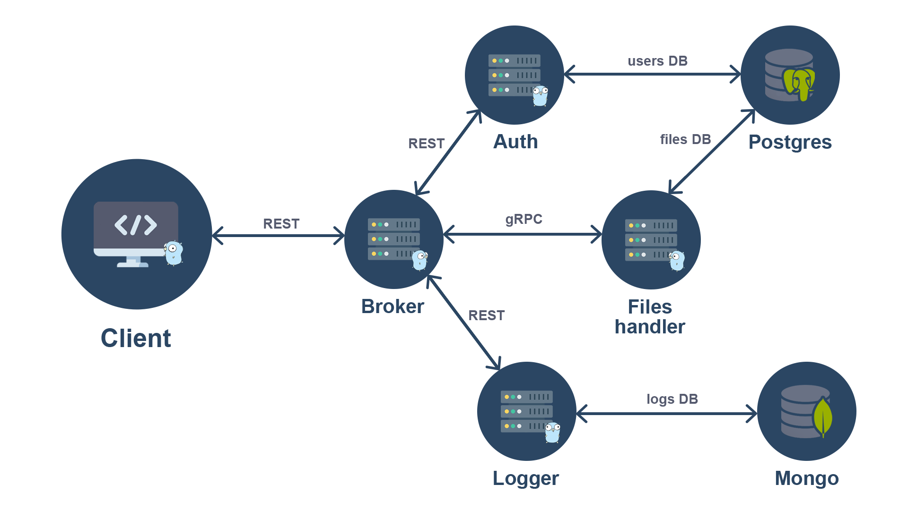

## Table of Contents

  
- [Overview](#overview)
- [Installation](#installation)
- [Usage](#usage)

 
## Overview

  

This project provides users with a secure platform to sign in, upload, and retrieve their files. It employs a microservices architecture, with a Golang-based backend utilizing the Gin framework and gRPC for communication. Below is a simplified illustration of the microservices communication:

  



  

## Installation

To get started with the project, follow the installation steps below.

### Prerequisites

  

Before installing the project, ensure that you have the following prerequisites installed:

  

-  **Go Version 1.19:**

  

You need Go version 1.19 or later. Check your Go version using the following command:

  

```bash
go version
```
  

-  **Make:**

  

Make is used for building and managing the project. Verify if Make is installed with:

```bash
make --version
```


-  **Docker:**

  

The project relies on Docker for containerization. Check if Docker is installed:

  

```bash
docker --version
```


-  **Docker Compose:**

  

Docker Compose is used for defining and running multi-container Docker applications. Check if Docker Compose is installed:

  
  

```bash
docker-compose --version
```

  

### Installation Steps

  

To install the project, follow these steps:

  

```bash
git clone https://github.com/rf-krcn/file-saver.git

cd file-saver

make -C project install
```

  

**Note:** Ensure that ports 3000 and 8080 are available and not in use by other applications on your system.

## Usage

To run the project, open a terminal, navigate to the project directory, and execute the following command:

```bash
make -C project up_build
```
Once the project is running, open your web browser and go to [http://localhost:3000](http://localhost:3000/) to access the application.

To stop the project, use the following command:
```bash
make -C project down
```
